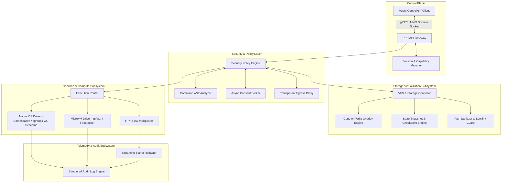
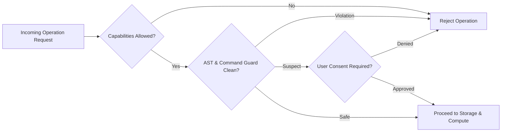
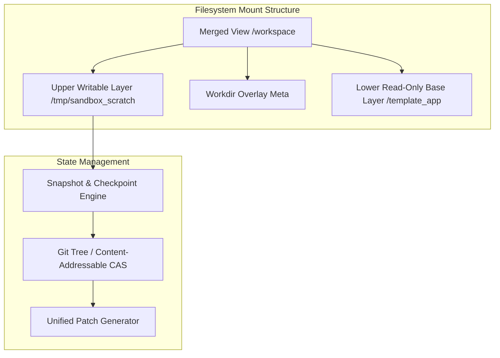
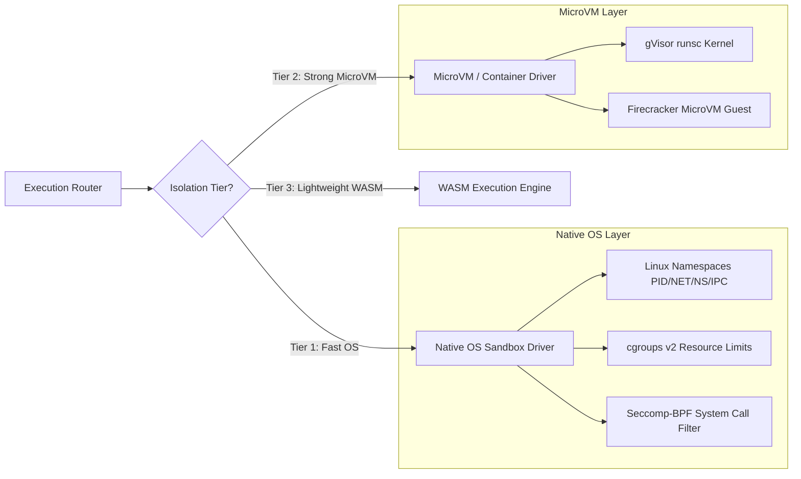

# Agent Sandbox Engine — Architecture Overview

This document captures the high-level architecture, invariants, subsystem breakdown,
and implementation roadmap for a secure, low-latency Agent Sandbox Engine. It
includes mermaid diagrams that describe the control plane, security & policy
layering, storage virtualization, execution tiers, and telemetry/audit flow.

## 1. System Vision & Architecture Principles

The Agent Sandbox Engine is a high-security, low-latency, deterministic execution
environment for autonomous AI agents. Key principles:

- Isolation Invariant: sandbox instances cannot access host or other sandbox state.
- Ephemeral Invariant: executions start from a known immutable base state; changes
  live in transient overlays that can be rolled back atomically.
- Least Privilege: deny-by-default permissions for filesystem, network, syscalls.
- Auditability: every syscall, command, file change, and stream byte is logged.



---

## 2. System Invariants & Security Boundaries

1. Isolation Invariant — Execution cannot access host or other sandbox instances.
2. Ephemeral Invariant — Sessions start from immutable base images; overlays are transient.
3. Least Privilege Invariant — Explicit capability grants required for network, FS, env.
4. Auditability Invariant — Every syscall, command, file diff, and stream is recorded.

---

## 3. Subsystem Breakdown

### 3.1 Control Plane & RPC Gateway

The Control Plane exposes a strongly-typed RPC API for agent controllers. Example
endpoints the gateway should provide:

- `ExecuteCommand(CommandSpec) -> stream ExecutionProgress`
- `SpawnPTY(PTYSpec) -> stream PTYFrame`
- `WriteFile(FilePayload) -> OperationStatus`
- `ReadFile(FileRequest) -> FileData`
- `CreateCheckpoint(CheckpointLabel) -> SnapshotID`
- `RestoreCheckpoint(SnapshotID) -> OperationStatus`
- `GetDiff(SnapshotID_A, SnapshotID_B) -> PatchSet`

It delegates authentication and capability enforcement to a session manager.

### 3.2 Security & Policy Subsystem

The Policy Engine is the gatekeeper for all operations. It integrates:

- Capability matrices (filesystem, network, commands, env vars)
- `CommandASTAnalyzer` for shell command parsing and forbidden-pattern detection
- `ConsentBroker` for interactive approvals
- `EgressProxy` for outbound network filtering and inspection



### 3.3 Storage Virtualization Subsystem

Use layered virtual storage (CoW) to preserve base images and capture diffs in an
upper writable layer. Provide quick snapshotting via inode indexing or content-addressed
hash trees and support atomic rollbacks by swapping overlay pointers.



Key pieces:

- Overlay engine (overlayfs on Linux; fallback drivers on macOS/Windows)
- Snapshot engine generating CAS-indexed snapshots and reverse patch deltas
- Path sanitizer to canonicalize paths and prevent symlink traversal

### 3.4 Compute & Execution Subsystem

Support multi-tier execution backends with an Execution Router selecting the
isolation tier per request.



Implementation notes:

- Native OS Driver: set up PID/NET/NS/IPC namespaces, cgroups v2, Seccomp-BPF filters.
- MicroVM Driver: launch minimal guests via gVisor or Firecracker for stronger isolation.
- PTY subsystem: multiplex PTY frames, handle resize events, and redact secrets on the fly.

---

## 4. Telemetry, Observability & Auditing

Produce cryptographically verifiable, append-only audit logs for every relevant
event. Stream stdout/stderr through a `SecretRedactor` that masks tokens and
high-entropy strings prior to transmission or logging.

Example audit JSON event:

```json
{
  "timestamp": "2026-08-02T16:05:00Z",
  "session_id": "sbx_89f1a",
  "event_type": "PROCESS_EXECUTE",
  "command": "python script.py",
  "pid": 402,
  "exit_code": 0,
  "duration_ms": 142,
  "resource_usage": { "cpu_ms": 95, "peak_memory_bytes": 18432000 },
  "policy_decision": "ALLOWED_AUTO"
}
```

---

## 5. Threat Matrix & Defense-in-Depth

Summarized defenses:

- Kernel/Container escape: Seccomp-BPF + gVisor/Firecracker boundary
- Fork bombs/memory exhaustion: cgroups v2 limits and process reaper
- Symlink traversal: path sanitizer + mount namespace chroot-like restrictions
- Data exfiltration: EgressProxy domain whitelists + isolated net namespaces
- Secret leakage: streaming secret redactor
- State tampering: read-only base layer + CAS snapshots and rollbacks

---

## 6. Implementation Roadmap (High Level)

Phase 1: VFS & Snapshot Engine

Phase 2: Native OS Driver + PTY

Phase 3: Policy Engine + AST Analyzer + Secret Redactor

Phase 4: MicroVM / Container Tier & warm pool optimizations

Phase 5: RPC Gateway, agent integration, and full test coverage

---

## 7. Next actions in this repo

- Expand `hamster/policy.py` AST analysis into a robust shell parser.
- Implement `RuntimeOrchestrator.launch_native` with namespace/cgroup/seccomp setup.
- Replace in-process `hamster/rpc.py` with a gRPC-based RPC gateway.
- Integrate cryptographic signing for audit logs.

---

This file is a living reference; update as subsystems are implemented and hardened.
